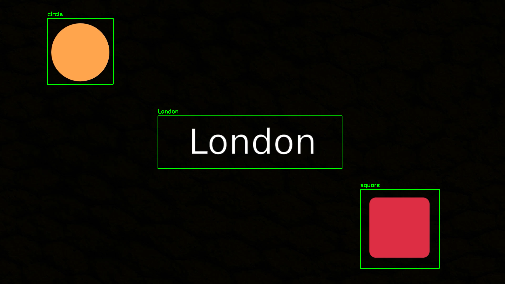
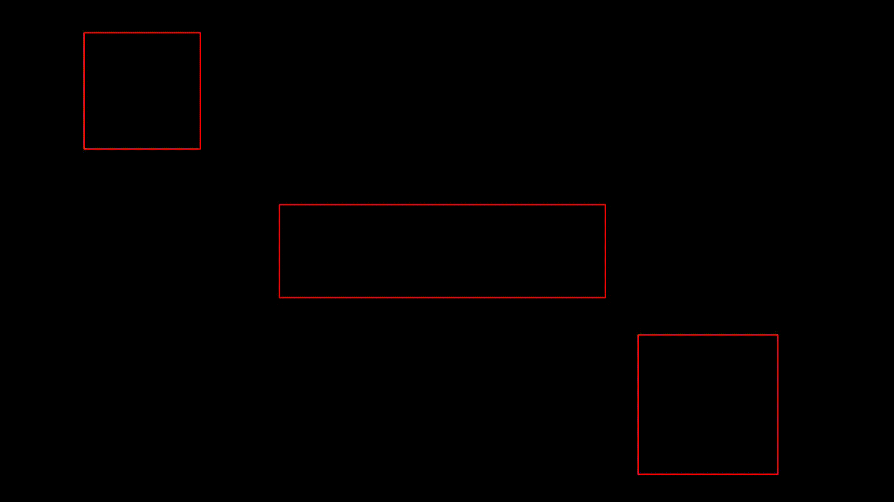

# VOCR

VOCR for **V**ideo **O**ptical **C**haracter **R**ecognition.

This module allows you to extract data from an image, a video, or your screen directly.

The module is mainly based on [OpenCV](https://github.com/opencv/opencv-python) and [EasyOCR](https://github.com/JaidedAI/EasyOCR) technologies.

```sh
python3 vocr.py -h
```

```
usage: vocr.py [-h] -d DFILE [-i IFILE] [-v VFILE] [-o OFILE] [-r RFILE]

options:
  -h, --help            show this help message and exit
  -d DFILE, --dfile DFILE
                        path to input data
  -i IFILE, --ifile IFILE
                        path to image file
  -v VFILE, --vfile VFILE
                        path to video file
  -o OFILE, --ofile OFILE
                        path to optionaly output image/video file
  -r RFILE, --rfile RFILE
                        path to optionaly result file
```

---

---

## Examples

You can reproduce the examples directly by typing the following commands:

### With an image

```sh
python3 vocr.py -d example/data.json -i example/image.png -o example/output/image.png
```

## 

### With a video

```sh
python3 vocr.py -d example/data.json -v example/video.mp4 -o example/output/video.avi -r example/output/result.json
```

## 

### With a stream

No examples are provided for the stream but you can create your own. To do so, simply leave the `-i` and `-v` options blank.

---

---

## Possible uses

There are two possible uses :

- Directly from the terminal (explained in detail below)
- By integrating the folder into your project :

```python
import vocr
import json

# Called at every scan
def callback(dict):
    print('callback:', dict)


def main():
    # Extract data from stream, call `callback` after every scan
    # Stop only when user press CTRL + C
    data = vocr.extract_data('data.json', callback=callback)

    # Print the final data when user pressed CTRL+C
    print(json.dumps(data, indent=4))


if __name__ == "__main__":
    main()
```

---

---

## Before running the script

- Use the `-i` option to scan an image
- Use the `-v` option to scan a video

If none of the options are selected, then the main screen will be used as the video stream.

---

You can specify the `-r` option to define a result file.

If the data comes from the screen as a video stream, then you will **need** to specify this option.

The terminal will be used to display the data in real time.

---

You can specify the `-o` option to define an output file.

If you process an image, the output file will be the same image annotated with the extracted information.

If it is a video or the video stream from a screen, then the output file will be a video including the extracted information.

---

---

## What does the data files look like?

### Input data file

The input data file is a JSON which contains a list of objects with a label, a box and potentially a 'match-pattern' attribute.

```json
[
  {
    "label": "center",
    "box": [600, 440, 700, 200]
  },
  {
    "label": "top.left",
    "box": [180, 70, 250, 250],
    "match-pattern": {
      "circle": "example/patterns/circle.png",
      "square": "example/patterns/square.png"
    }
  },
  {
    "label": "bottom.right",
    "box": [1370, 720, 300, 300],
    "match-pattern": {
      "circle": "example/patterns/circle.png",
      "square": "example/patterns/square.png"
    }
  }
]
```

### Output data file

The output data file is another JSON that could look like this:

```json
[
    {
        "id": 1,
        "time": 0.03295707702636719,
        "data": {
            "center": [],
            "top.left": null,
            "bottom.right": null
        }
    },
    {
        "id": 2,
        "time": 0.7343497276306152,
        "data": {
            "center": [
                "Paris"
            ],
            "top.left": null,
            "bottom.right": null
        }
    },
    {
        "id": 7,
        "time": 2.186099052429199,
        "data": {
            "center": [
                "Prague"
            ],
            "top.left": "circle",
            "bottom.right": null
        }
    }
```

---

---

## Questions

### How to extract from an image?

#### To show informations directly in the terminal :

```sh
python3 vocr.py -i <path-to-image> -d data.json
```

#### To save informations in a file :

```sh
python3 vocr.py -i <path-to-image> -d data.json -r result.json
```

#### To save a picture of the annoted image :

```sh
python3 vocr.py -i <path-to-image> -d data.json -o output.png
```

#### To do everything :

```sh
python3 vocr.py -i <path-to-image> -d data.json -o output.png -r result.json
```

---

### How to extract from a video?

#### Without output annoted video :

```sh
python3 vocr.py -v <path-to-video> -d data.json -r result.json
```

Here, the frame progression will be shown in the terminal :

```
Frame 100/200 (50%)
```

#### With output annoted video :

```sh
python3 vocr.py -v <path-to-video> -d data.json -r result.json -o output.avi
```

---

### How to extract from my screen?

#### Without output annoted video :

```sh
python3 vocr.py -d data.json -r result.json
```

Here the data will be shown on the terminal, depending on what you have included in the data file.

#### With output annoted video :

```sh
python3 vocr.py -v <path-to-video> -d data.json -r result.json -o output.avi
```

Enjoy :)
